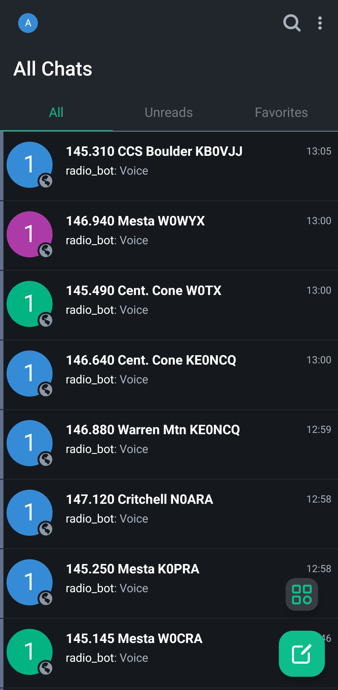
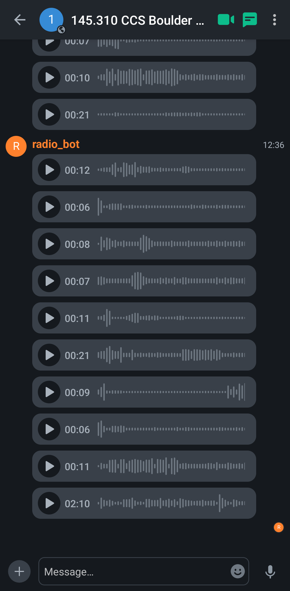

[](https://github.com/poljar/matrix-nio)

# Matrix RF Bridge

<p align="middle">
  
   
</p>


## Overview

The Matrix RF Bridge is a Python-based tool that uploads recordings from an `RTLSDR-Airband` instance (running in multichannel mode) to a Matrix server (e.g., Synapse). Each frequency is mapped to its own room (e.g., `#145.145MHz:yourdomain.com`) within a Matrix space, allowing users to browse and listen to recordings via a Matrix client like Element. The project leverages `RTLSDR-Airband` for all demodulation and recording and `matrix-nio` for Matrix interactions, all running within Docker containers for easy deployment.

This could be used to monitor ATC audio or amateur radio transmissions (the repeater output and some FM simplex frequencies of the North American 2 meter band plan fit nicely within the bandwidth of an RTL-SDR).

### Features

- **Multi-Frequency Monitoring**: Monitors multiple frequencies within the SDR’s bandwidth simultaneously (`RTLSDR-Airband` multichannel mode). It is not currently compatible with scan mode, due to the way it parses the `RTLSDR-Airband` config file to get channels.
- **Automatic Recording**: Records transmissions into `.mp3` files when squelch is opened, with filenames including the frequency in Hz.
- **Matrix Integration**: Uploads recordings to Matrix homeserver, then sends a voice message (MSC1767/MSC3245) to dedicated Matrix rooms, organized by frequency.
- **Waveform Visualization**: Generates waveforms for display in compatible Matrix clients (e.g., Element).
- **Duration Filtering**: Optionally skips uploads of recordings shorter than a configurable duration (via `MIN_AUDIO_DURATION`).
- **File Cleanup**: Deletes source MP3 files after successful upload to manage disk space.
- **Configurable**: Uses an `rtl_airband.conf` file to define channels, with optional skipping of disabled channels via an environment variable.
- **Dockerized**: Runs in Docker containers (example `docker-compose.yml` provided), accessing the SDR via pass through.

## Requirements

### Hardware

- SDR supported by `RTLSDR-Airband`.
- Computer or server with access to the SDR and network connectivity.

### Software

- **Operating System**: Linux (recommended), macOS, or Windows (with Docker Desktop).
- **Docker**: Docker and Docker Compose for containerized deployment.

### Dependencies

- **Matrix Server**: A running Matrix homeserver (such as Synapse) with a registered bot user.
- **Python Libraries** (installed via Docker):
  - `matrix-nio`: For Matrix interactions.
  - `watchdog`: For filesystem monitoring.
  - `pydub`: Audio processing for duration and waveforms.
  - `numpy`: Waveform calculations.

## Installation Instructions

### Prerequisites

1. **Install Docker**:
   - See instructions at [docker.com](https://www.docker.com/get-started).

2. **Set Up Synapse**:
   - Follow the [Synapse installation guide](https://matrix-org.github.io/synapse/latest/setup/installation.html).
   - Register a bot user: `register_new_matrix_user -u radio_bot -p <password> -a -c /path/to/homeserver.yaml`.

3. **Prepare Configuration**:
   - See [example](examples/rtl_airband_example.conf) and edit/add SDR parameters and frequencies for your needs. Keep the file output options as shown in the example.

4. **Create Docker Compose File**:
   - See [example](examples/docker-compose-example.yml) and edit for your needs (file paths, etc.).

5. **Run**:
```bash
docker-compose up
```

## Usage

`rtlsdr-airband` connects to the specified SDR and saves recordings to /recordings, according to the frequencies specified in `rtl_airband.conf`.

The uploader first reads the `rtl_airband.conf` file, creates rooms for each channel, skipping disabled channels. On first start, this may take some time if rate limiting is in effect on the matrix server. It then watches the `/recordings` directory, processes the .mp3 files, generates waveforms, and sends them as voice messages to frequency-specific rooms (e.g., #147.285MHz:yourdomain.com). Files are deleted after successful upload.

Use a client like Element access the Matrix server, join rooms, see waveforms, and listen to recordings. Change the room names as desired, the names will not be overridden.

## Configuration

The uploader relies on the `rtl_airband.conf` having specific parameters set. Keep the output block exactly as shown in the example.

### Environment Variables

- `SYNAPSE_URL`: Matrix server URL (default: http://synapse:8008).
- `BOT_USER`: Matrix bot username (e.g., radio_bot).
- `BOT_PASSWORD`: Bot password.
- `MATRIX_DOMAIN`: Your Matrix domain (e.g., yourdomain.com).
- `MIN_AUDIO_DURATION`: Minimum duration in milliseconds for uploads (e.g., 2000 for 2 seconds; default: 0, no filtering).
- `SKIP_DISABLED_CHANNELS`: Don't create/monitor rooms for channels that are disbaled in `rtl_airband.conf` (default: true).
- `DELETE_AFTER_UPLOAD`: Delete source mp3 files from recordings directory after successful upload (default: true).

## Notes

- Ensure the bot has upload permissions on the Matrix server.
- Ensure the containers have permissions for the mounted directories.
- Viewing waveforms requires a client like Element that supports MSC1767/MSC3245.
- Set retention policy on Matrix server to manage storage space.

## Contributing

Submit issues or pull requests for enhancements.

## Enchancement ideas

- **Real-Time Audio Streaming**: Use a streaming output of rtlsdr-airband and route to the VOIP feature of matrix.
- **Metadata**: Add metadata to voice messages, like signal strength, etc.
- **Voice transciption**: Transcribe audio and include the text with messages.
- **Data mode decoding**: Decode non-voice transmissions (e.g. APRS/AX.25, CW, etc.) and send data as message. Direwolf? multimon-ng? Another?
- **Transmit**: Voice (or data) messages sent to the rooms could be broadcast over RF with suitable equipment.
- **Frequency Grouping**: Organize recordings into Matrix spaces (e.g., one space per band like VHF/UHF) instead of just individual rooms per frequency.
- ~~**DONE Waveform Scaling improvements**: Current the waveform is scaled such that the max is based on the largest rms value. using percentile would give better dynamic range.~~
- **Upload Retry Mechanism**: Retry failed uploads (e.g., due to network issues) with exponential backoff. Wrap the client.upload and room_send calls in a retry loop using asyncio. Periodically scan recordings directory for files missed if the uploader was not running while rtlsdr-airband was.
- **Configuration file specific to the project**: Currently uses the `rtl_airband.conf` file to generate rooms, could do the otherway around, maybe with simple csv files for the channels.
- **Parallel Uploads**: Process and upload multiple recordings concurrently to handle high recording rates. Use asyncio.gather to run multiple upload_file tasks.
- **Metrics**: Process for showing per channels statistics (e.g. transmissions per hour, airtime utilization, signal strength, etc.)
- **Quick start guide**: Lowers the entry barrier for new users.
- **Continuous Integration**: Add tests to the GitHub Actions workflow to verify the uploader works across architectures.
- **Refactor/code organization**: Break code into logical modules under a package structure, making it easier to manage.

## License

MIT License. See [LICENSE](LICENSE) for details.

## Acknowledgments

Tools: `rtl_airband`, `matrix-nio`, `pydub`, `numpy`.

[Grok](https://grok.com/share/bGVnYWN5_dc34ee7a-6ab6-4fab-a7c0-ceb1468cd419) helped get this up and running quickly and is continuing to help with new features and improvements!
